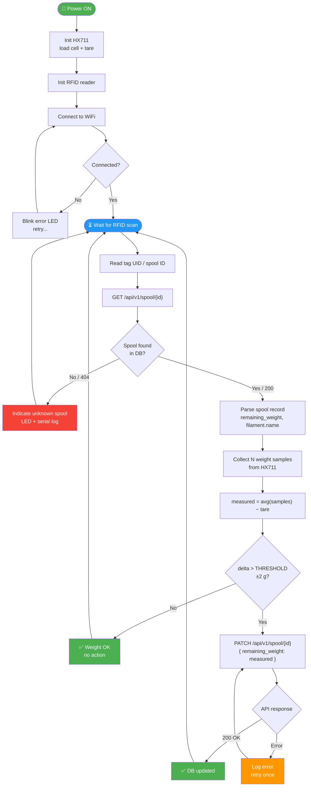

# ESP32 Spoolman Scale

## Overview

An ESP32-based smart scale that identifies filament spools via RFID tags, fetches spool metadata from a [Spoolman](https://github.com/Donkie/Spoolman) instance over WiFi, weighs the spool, and automatically updates the database if the measured weight differs from the stored value.

---

## System Flowchart



---

## Hardware Components

| Component | Role |
|---|---|
| ESP32 | Main microcontroller |
| Load cell + HX711 | Weight measurement |
| RFID reader (e.g. RC522 / PN532) | Spool identification |
| RFID tags | Attached to each spool, store spool ID |
| WiFi | Communication with Spoolman REST API |

---

## Operation Flow

### Phase 1 — Boot & Initialization

```
Power ON
  │
  ├─ Initialize peripherals
  │    ├─ HX711 (load cell amplifier) — tare & calibrate
  │    └─ RFID reader (SPI/I2C)
  │
  └─ Connect to WiFi
       ├─ [OK] → proceed
       └─ [FAIL] → retry loop / blink error LED
```

### Phase 2 — Main Loop

```
Wait for RFID tag scan
  │
  ├─ Read tag UID
  │
  ├─ Query Spoolman API
  │    GET /api/v1/spool?tag_uid={uid}
  │    │
  │    ├─ [404 / not found]
  │    │    └─ Indicate "unknown spool" (LED / serial)
  │    │         └─ Return to WAIT
  │    │
  │    └─ [200 OK]
  │         └─ Parse spool record
  │              ├─ spool.id
  │              ├─ spool.remaining_weight  ← stored value
  │              └─ spool.filament.name    (for display)
  │
  ├─ Weigh spool
  │    ├─ Stabilize reading (N-sample average)
  │    └─ measured_weight = raw_reading - empty_spool_tare
  │
  ├─ Compare weights
  │    delta = |measured_weight - spool.remaining_weight|
  │    │
  │    ├─ delta ≤ THRESHOLD (e.g. ±2 g)
  │    │    └─ "Weight OK" — no update needed
  │    │
  │    └─ delta > THRESHOLD
  │         └─ Update Spoolman
  │              PATCH /api/v1/spool/{spool.id}
  │              { "remaining_weight": measured_weight }
  │              │
  │              ├─ [200 OK] → "Updated ✓"
  │              └─ [FAIL]   → log error, retry once
  │
  └─ Return to WAIT (loop forever)
```

---

## API Interactions

### Spoolman REST API

Base URL: `http://<spoolman-host>:<port>/api/v1`

| Step | Method | Endpoint | Purpose |
|---|---|---|---|
| Look up spool by RFID | `GET` | `/spool?tag_uid={uid}` | Check if tag is registered |
| Fetch spool details | `GET` | `/spool/{id}` | Get `remaining_weight` and filament info |
| Update spool weight | `PATCH` | `/spool/{id}` | Write new `remaining_weight` |

> **Note:** `tag_uid` support depends on Spoolman version. Alternatively, the RFID tag can store the numeric spool ID directly, simplifying lookup to a single `GET /spool/{id}`.

---

## Key Configuration Parameters

```cpp
// WiFi
const char* WIFI_SSID     = "your_ssid";
const char* WIFI_PASSWORD = "your_password";

// Spoolman
const char* SPOOLMAN_HOST = "192.168.1.x";
const int   SPOOLMAN_PORT = 7912;

// Scale
const float CALIBRATION_FACTOR = 420.0;   // tune per load cell
const float EMPTY_SPOOL_WEIGHT = 230.0;   // grams, tare offset
const float WEIGHT_THRESHOLD   = 2.0;     // grams, min delta to trigger update
const int   SAMPLE_COUNT       = 10;      // readings averaged per measurement
```

---

## State Machine Summary

| State | Trigger | Next State |
|---|---|---|
| `INIT` | Boot | `WIFI_CONNECT` |
| `WIFI_CONNECT` | Connected | `WAIT_RFID` |
| `WIFI_CONNECT` | Timeout | retry → `WIFI_CONNECT` |
| `WAIT_RFID` | Tag scanned | `LOOKUP_SPOOL` |
| `LOOKUP_SPOOL` | Found | `WEIGH` |
| `LOOKUP_SPOOL` | Not found | `WAIT_RFID` |
| `WEIGH` | Reading stable | `COMPARE` |
| `COMPARE` | Delta ≤ threshold | `WAIT_RFID` |
| `COMPARE` | Delta > threshold | `UPDATE_DB` |
| `UPDATE_DB` | Success / fail | `WAIT_RFID` |

---

## Infrastructure & Deployment

Spoolman runs as a Docker container within the lab's shared stack, deployed via Ansible to `prod` and `preprod` environments.

### Docker Service

```yaml
spoolman:
  image: ghcr.io/donkie/spoolman:latest
  container_name: spoolman
  restart: unless-stopped
  volumes:
    - ./spoolman:/root/.local/share/spoolman
  environment:
    - TZ=Europe/Warsaw
  command: uvicorn spoolman.main:app --host 0.0.0.0 --port 8000
```

Data is persisted to `./spoolman/` on the host at `/root/.local/share/spoolman` inside the container.

### Reverse Proxy (Caddy)

Caddy fronts the service with automatic TLS via Cloudflare DNS-01 challenge:

```
spoolman.aghrapid.top         → spoolman:8000  (prod)
spoolman-preprod.aghrapid.top → spoolman:8000  (preprod)
```

The wildcard cert for `*.aghrapid.top` is shared across all services in the stack.

### Ansible Deployment

Deployed with `docker_deploy.yml` targeting `prod` / `preprod` groups from `inventory.yml`:

| Environment | Ansible host | Internal DNS |
|---|---|---|
| prod | `docker` | `docker.rapid.internal` |
| preprod | `docker-preprod` | `docker-preprod.rapid.internal` |

The playbook syncs compose files from `../docker-compose/<hostname>/` to `/opt/` on the target, injects `secrets.env`, and runs `docker compose up` via `community.docker.docker_compose_v2`.

### ESP32 API Base URL

```cpp
// Via public HTTPS (recommended — works from any network):
const char* SPOOLMAN_HOST = "spoolman.aghrapid.top";
const int   SPOOLMAN_PORT = 443;
const bool  SPOOLMAN_TLS  = true;

// Or direct internal access (same LAN only):
// const char* SPOOLMAN_HOST = "docker.rapid.internal";
// const int   SPOOLMAN_PORT = 8000;
```

---

## Notes & TODOs

- [ ] Decide RFID tag payload: **spool ID** (simple) vs **UID → lookup** (requires Spoolman tag support)
- [ ] Define empty spool tare strategy — fixed constant or per-filament-type lookup
- [ ] Add display output (OLED / serial monitor) for weight and status feedback
- [ ] Implement OTA update support
- [ ] Consider offline fallback (cache last known spool data in NVS) if WiFi drops mid-session
- [ ] Unit: confirm Spoolman expects `remaining_weight` in **grams**