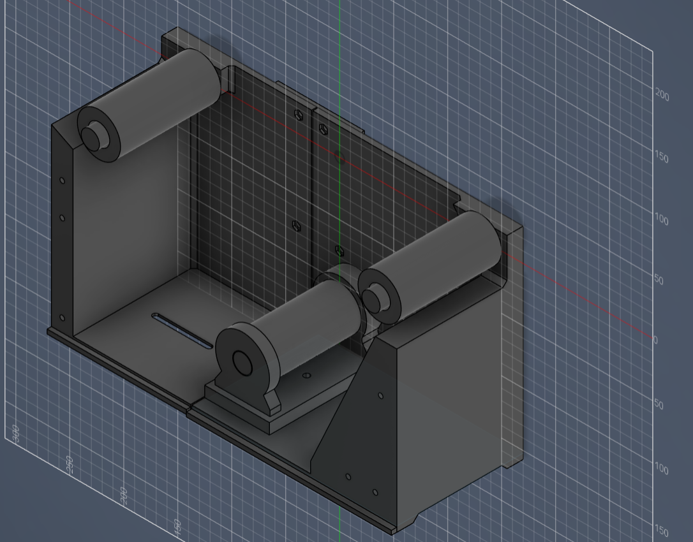
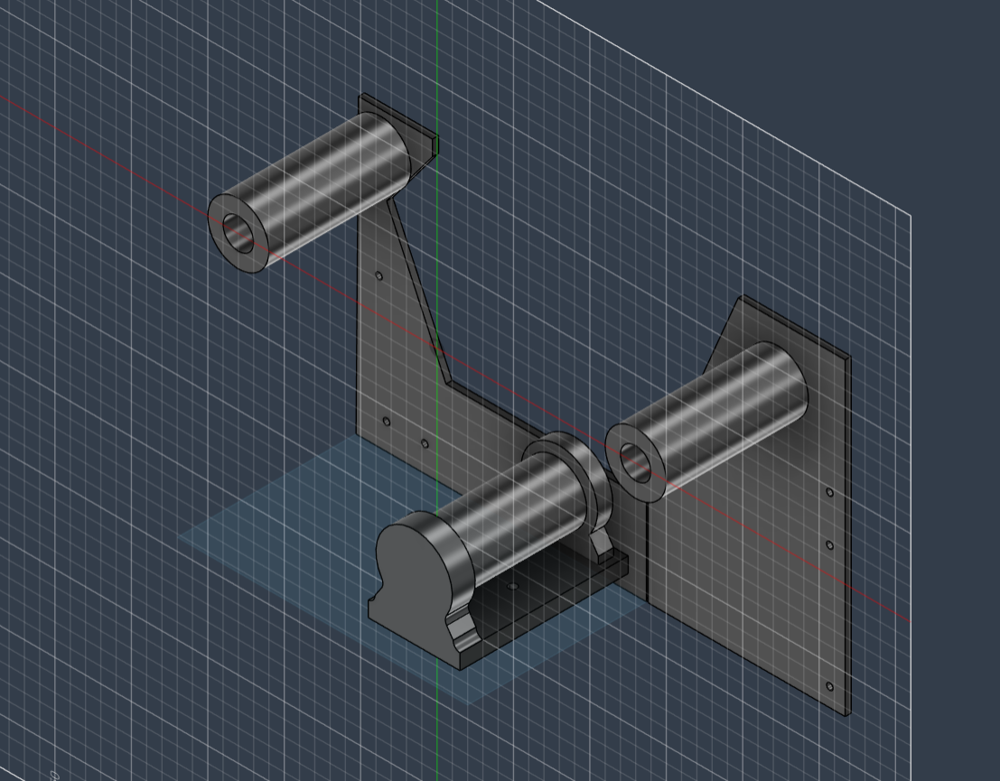
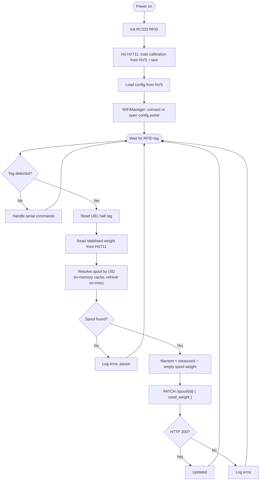

# ESP32 Spoolman Scale


A headless smart scale that automates 3D-printing filament inventory. Place an
RFID-tagged spool on the scale and the device identifies it, weighs it, computes
how much filament is left, and writes the result back to a
[Spoolman](https://github.com/Donkie/Spoolman) instance over its REST API. No
buttons, no screen, no manual data entry.

<p align="center">
  
  
</p>

## How it works

1. On boot the device initialises the RFID reader and the load cell, loads its
   saved configuration from flash, and connects to WiFi (falling back to a
   configuration portal if no credentials are stored).
2. The main loop waits for an RFID tag. When one appears it reads the tag UID.
3. The device resolves the UID to a Spoolman spool, reads a stabilised weight
   from the load cell, and computes the filament mass.
4. It updates the spool's `used_weight` in Spoolman with a single `PATCH`.
5. Back to waiting for the next tag.



## Hardware

| Component | Part | Interface |
|---|---|---|
| Microcontroller | Wemos LOLIN S2 Mini (ESP32-S2, single-core) | WiFi |
| Load-cell amplifier | HX711  | I2C |
| Weight sensor | strain-gauge load cell (beam) | analog to HX711 |
| RFID reader | RC522 | software SPI |

> The ESP32-S2 is single-core. The current, mostly-blocking firmware fits
> comfortably on one core, but moving the RFID polling, networking and weighing
> onto separate FreeRTOS tasks (for example on a dual-core ESP32-S3) is the
> natural next step. See the [Roadmap](#roadmap).

### Pin map

Pins are defined in [`src/pins.h`](src/pins.h):

| Peripheral | Signal | GPIO |
|---|---|---|
| RC522 | SS | 13 |
| RC522 | RST | 14 |
| RC522 | MISO | 10 |
| RC522 | MOSI | 11 |
| RC522 | SCK | 12 |
| HX711 | DT | 16 |
| HX711 | SCK | 17 |

A 3D-printable enclosure designed in CAD lives in
[`3d-models/`](3d-models/); it houses the board, the HX711 and the reader, with
the load cell and spool platform on top.

## Software architecture

The firmware is written in modern C++ on the Arduino framework and is organised
around small, single-responsibility classes. `main.cpp` is the composition root:
it instantiates everything once and wires the objects together through
constructor references (dependency injection), which keeps the modules loosely
coupled and easy to reason about.

```cpp
Config          config;
Scale           scale(HX711_DT, HX711_SCK);
RFIDReader      rfid(RFID_SS, RFID_RST, RFID_SCK, RFID_MISO, RFID_MOSI);
SpoolmanClient  spoolman(config);                       // const Config&
CommandHandler  commands(scale, rfid, spoolman, config); // references
```

| Module | Responsibility |
|---|---|
| [`Config`](src/Config.h) | Persistent settings (Spoolman URL) in NVS flash; WiFiManager captive portal |
| [`Scale`](src/Scale.h) | HX711 wrapper: tare, calibration (persisted to NVS), stabilised reads |
| [`RFIDReader`](src/RFIDReader.h) | RFID wrapper over software SPI: `poll` / `halt` / `getUID` |
| [`SpoolmanClient`](src/SpoolmanClient.h) | REST client; UID-to-spool cache; fetch and update operations |
| [`CommandHandler`](src/CommandHandler.h) | Non-blocking serial command parser; delegates to subsystems |
| `SpoolInfo` | Plain data-transfer object describing one spool |

A few design points worth calling out:

- **Client-side RFID cache.** Spoolman has no "look up a spool by RFID" endpoint,
  so `SpoolmanClient` fetches the full spool list once (`GET /spool`), builds an
  in-memory `extra.rfid → id` map, and reuses it. A cache miss triggers exactly
  one refresh (to catch a spool that was just added) before giving up.
- **Stabilised weighing.** Instead of a single reading, `Scale` keeps a sliding
  window of the last few averaged samples and only accepts a measurement once
  the spread drops below a tolerance, with a bounded number of attempts.
- **Zero secrets in source.** WiFi credentials and the Spoolman URL are entered
  once through the WiFiManager portal and stored in NVS; the calibration factor
  is persisted the same way and survives reboots.
- **Responsive serial console.** `CommandHandler` processes at most one command
  per call and is woven into the main loop and the post-update wait windows, so
  diagnostics stay responsive at all times.

## REST API usage


| Method + path | Purpose | Fields used |
|---|---|---|
| `GET /spool` | Fetch the spool list and build the UID cache | `id`, `extra.rfid` |
| `GET /spool/{id}` | Fetch spool details | `spool_weight`, `filament.weight`, `used_weight` |
| `PATCH /spool/{id}` | Write the new usage | body `{ "used_weight": <grams> }` |
| `GET /` | Reachability check | HTTP status |

The new usage is computed as

```
filament_weight = measured_total − empty_spool_weight        (clamped ≥ 0)
used_weight     = full_filament_weight − filament_weight      (clamped ≥ 0)
```

JSON is parsed with ArduinoJson straight from the HTTP stream to keep RAM use low.

## Getting started

### Build and flash

This is a [PlatformIO](https://platformio.org/) project targeting the
`lolin_s2_mini` board. Dependencies are declared in `platformio.ini` and fetched
automatically (`MFRC522`, `HX711`, `ArduinoJson`, `WiFiManager`).

```bash
pio run                 # build
pio run --target upload # flash
pio device monitor      # serial console @ 115200
```

### First-time setup

1. **Configure WiFi and the server.** On first boot (or if it cannot connect)
   the device opens a `SpoolmanScale` WiFi access point with a captive portal.
   Join it and enter your WiFi details plus the Spoolman API URL.
2. **Calibrate the scale.** In the serial monitor send `ONE_KG_SCALE`, then
   follow the prompts: clear the platform and confirm, place a 1000 g reference
   and confirm. The factor is saved to flash.
3. **Tag your spools.** Store each tag's UID in the corresponding spool's
   `extra.rfid` field in Spoolman.
4. **Use it.** Put a tagged spool on the scale and present the tag. The device
   weighs it and updates Spoolman automatically.

### Serial commands

| Command | Action |
|---|---|
| `WEIGHT` | Print the current reading |
| `TARE` | Tare the scale |
| `RFID` | Print the last UID seen |
| `SPL_STATUS` | Check server reachability |
| `WIFI_STATUS` | Print SSID and IP |
| `ONE_KG_SCALE` | Run the interactive 1 kg calibration |

Status and errors are reported on the serial console.

## Deployment

In our setup Spoolman runs as a Docker Compose service behind a reverse proxy
Caddy, provisioned with Ansible across a staging and a production
environment.

## Roadmap

- [ ] Move to a dual-core ESP32 (e.g. ESP32-S3) and split RFID, networking and
      weighing into separate FreeRTOS tasks.
- [ ] Native RFID lookup (or store the spool ID on the tag) to avoid fetching
      the full spool list.
- [ ] Update threshold (debounce) to skip writes for tiny weight changes.
- [ ] OLED display for weight and status.
- [ ] OTA firmware updates.
- [ ] Offline fallback: cache the last known spool data in NVS if WiFi drops.
- [ ] Verify the server certificate (CA pinning) on the HTTPS connection.

## Project layout

```
src/
  main.cpp            orchestration: setup() and loop()
  Config.*            persistent config + WiFiManager portal
  Scale.*             HX711 wrapper, calibration, stabilised reads
  RFIDReader.*        MFRC522 wrapper (software SPI)
  SpoolmanClient.*    REST client + UID cache
  CommandHandler.*    serial command interface
  pins.h              GPIO assignments
3d-models/            enclosure (CAD)
photos/               prototype photos
```

## License

Released under the MIT License. See [LICENSE](LICENSE).
